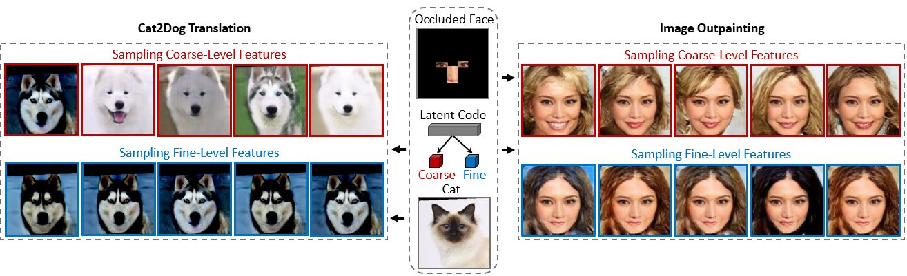

# Nested Scale-Editing for Conditional Image Synthesis
This is a Pytorch implementation of our paper "Nested Scale-Editing for Conditional Image Synthesis". 

[Nested Scale-Editing for Conditional Image Synthesis](https://arxiv.org/pdf/2006.02038.pdf) <br />
[Lingzhi Zhang*](https://owenzlz.github.io/), Jiancong Wang*, Yinshuang Xu, Jie Min, Tarmily Wen, James C. Gee, [Jianbo Shi](https://www.cis.upenn.edu/~jshi/) (* equal contribution) <br />
University of Pennsylvania

In Computer Vision and Pattern Recognition (CVPR), 2020

## Introduction

We proposed an image synthesis approach that provides stratified navigation in the latent code space. We achieve this through scale-independent editing while expanding scale-specific diveristy. Scale-independent is achieved with a nested scale disentanglement loss. Scale-specific diversity is created by incorporating a progressive diversification constraint.


    
## Usage

[Coming Soon]

## Citation
If you use this code for your research, please cite our [paper](http://openaccess.thecvf.com/content_CVPR_2020/papers/Zhang_Nested_Scale-Editing_for_Conditional_Image_Synthesis_CVPR_2020_paper.pdf):

```
@inproceedings{zhang2020nested,
  title={Nested Scale-Editing for Conditional Image Synthesis},
  author={Zhang, Lingzhi and Wang, Jiancong and Xu, Yinshuang and Min, Jie and Wen, Tarmily and Gee, James C and Shi, Jianbo},
  booktitle={Proceedings of the IEEE/CVF Conference on Computer Vision and Pattern Recognition},
  pages={5477--5487},
  year={2020}
}
```
